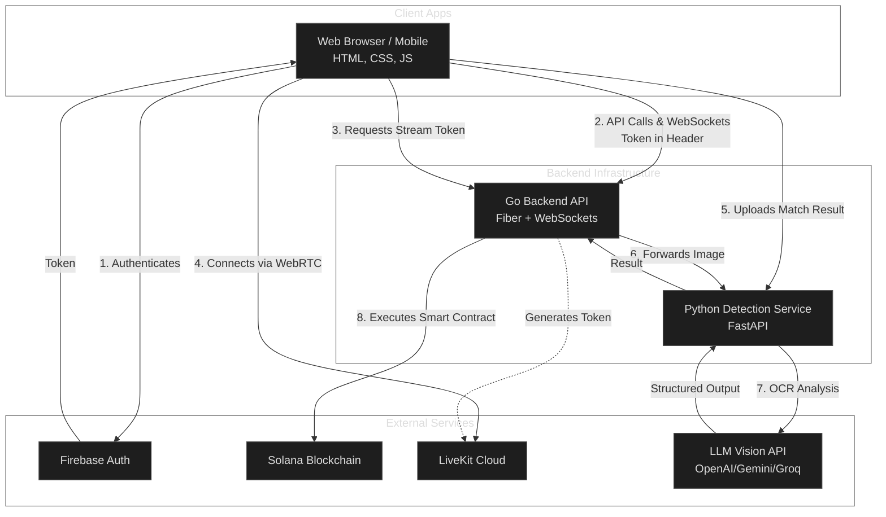

# High-Level System Architecture

```mermaid
flowchart TB
    subgraph ClientApps [Client Apps]
        Client["Web Browser / Mobile<br>HTML, CSS, JS"]
    end

    subgraph BackendInfrastructure [Backend Infrastructure]
        Python["Python Detection Service<br>FastAPI"]
        Go["Go Backend API<br>Fiber + WebSockets"]
    end

    subgraph ExternalServices [External Services]
        Firebase["Firebase Auth"]
        Solana["Solana Blockchain"]
        LiveKit["LiveKit Cloud"]
        LLM["LLM Vision API<br>OpenAI/Gemini/Groq"]
    end

    Client -- "1. Authenticates" --> Firebase
    Firebase -- "Token" --> Client
    Client -- "2. API Calls & WebSockets<br>Token in Header" --> Go
    Client -- "3. Requests Stream Token" --> Go
    Client -- "4. Connects via WebRTC" --> LiveKit
    Client -- "5. Uploads Match Result" --> Python

    Go -. "Generates Token" .-> LiveKit
    Go -- "6. Forwards Image" --> Python
    Python -- "Result" --> Go
    
    Python -- "7. OCR Analysis" --> LLM
    LLM -- "Structured Output" --> Python
    
    Go -- "8. Executes Smart Contract" --> Solana

    %% Styling
    classDef default fill:#1e1e1e,stroke:#555,stroke-width:1px,color:#ddd;
    classDef subgraphStyle fill:#161b22,stroke:#444,stroke-width:1px,color:#ddd;
    
    style ClientApps fill:transparent,stroke:#777,stroke-width:1px,color:#ddd
    style BackendInfrastructure fill:transparent,stroke:#777,stroke-width:1px,color:#ddd
    style ExternalServices fill:transparent,stroke:#777,stroke-width:1px,color:#ddd
```
