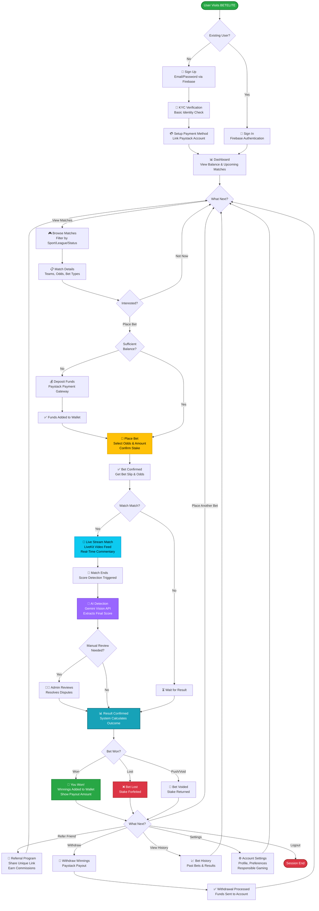

# BETELITE User Flow Diagram

## Complete User Journey

## User Flow Summary

### Phase 1: Onboarding
- User registration via Firebase
- KYC verification
- Payment method setup (Paystack)

### Phase 2: Match Discovery
- Browse available tournaments and matches
- View match details (teams, odds, bet types)
- Compare different bet options

### Phase 3: Betting
- Check wallet balance
- Deposit funds if needed (Paystack)
- Place bet with selected odds
- Get bet confirmation and slip

### Phase 4: Live Experience
- Optional: Watch live stream (LiveKit)
- View real-time match updates
- Monitor bet status

### Phase 5: Results & Settlement
- AI Detection (Gemini Vision) extracts final score
- System verifies result (admin review if disputed)
- Calculate bet outcome (Win/Loss/Push)

### Phase 6: Post-Match Actions
- View winnings/losses
- Withdraw funds (Paystack payout)
- View bet history
- Invite friends (referral program)
- Manage account settings

---

## Key Features Highlighted

🔑 **Authentication**: Firebase secure login  
💳 **Payments**: Paystack for deposits/withdrawals  
🤖 **AI Detection**: Gemini Vision API for automated score detection  
🎥 **Live Streaming**: LiveKit integration for match viewing  
👥 **Referrals**: Earn commissions by inviting friends  
⚙️ **Settings**: Account management & responsible gaming options  
📊 **History**: Complete bet tracking and analytics  
